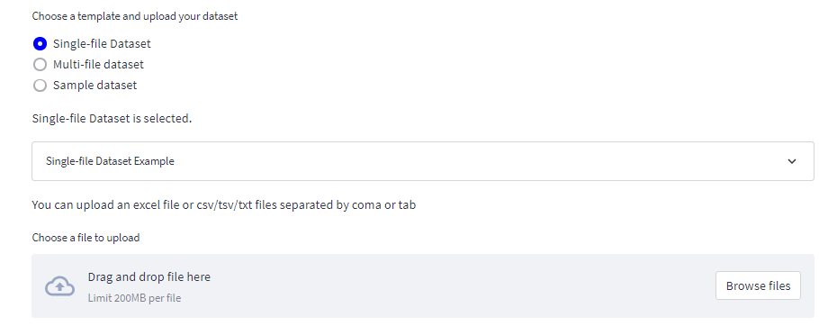

# Data Loading

On this page data can be loaded into the pipeline. The data can be loaded in two ways: single file upload and multi file upload. The single file upload should be used when the intensity data and the grouping information are in the same file. The multi file upload should be used when the intensity data and the grouping information are in separate files. 

When the upload mode is selected a sample dataset example is also shown. It can be viewed by expanding the Example box under the upload mode selection.

## 1. Select upload mode
----------------

### Single file upload
-----------
For single-file upload the data can be in the CSV or Excel formats. The data can be uploaded by clicking the "Upload Data" button or by dragging the file and droping in the provided area. After uploading the file a preview of the data is shown.

### Multi file upload
---------------
Multi-file upload should be used when the intensity data and the grouping information are in separate files. The data can be uploaded by clicking the "Upload Data" button under the Intensities section. After uploading the file a preview of the data will be shown below. The grouping information can be uploaded by clicking the "Upload Grouping" button in the Labels section. After uploading the file a preview of the data will be shown below.

### Sample dataset
---------------
Pro-T-Omics comes with a sample dataset. This dataset can be loaded by clicking the "Sample dataset" option as the upload mode and choosing from the list of provided exmple datasets. After loading the sample data a preview of the data will be shown.

## 2. Choose descriptive columns
----------------
Descriptive columns are the columns in the dataset that dont have numerical values. These columns might be the Protein name, Gene name, etc. The descriptive columns can be selected in the "Select descriptive columns" multi-select dropdown. A list of columns will be shown. The columns can be selected by clicking on them. The selected columns will be highlighted in blue. The columns can be deselected.

## 3. Select gropus to compare
----------------
The groups to compare can be selected in the "Select groups to compare" multi-select dropdown. A list of labels from the dataset will be shown. The lables can be selected by clicking on them. Two labels must be selected in this step.

The names of the selected labels/gropus can be changed below by editing the text boxes. The names of the labels/gropus will be used in the plots and tables.

The grouping method can be renamed as well. The gropuing method is the superset of the selected labels. The grouping method name will be used in the plots and tables.
